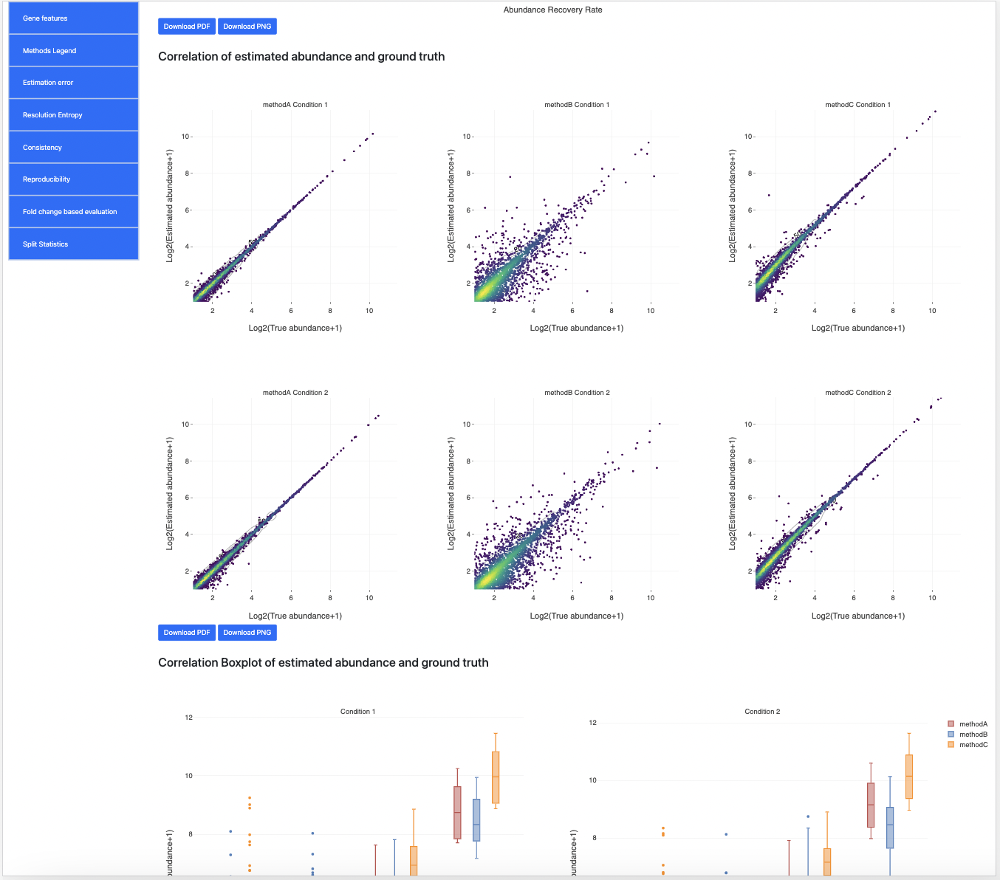

# lrgasp-challenge-2-evaluation
## Web application
We have a web application that illustrates the evaluation plots and functions [here](https://lrrna-seq-quantification.org).<br>
For a live video demo of this web app, you can check [here](https://youtu.be/y02MI8ZyF-E).
## Requirements
Running python 3.7 and linux64 on your machine
## Install
```
git clone https://github.com/Tidesun/LRGASP_visualization.git
cd LRGASP_visualization
conda create --name ch2 python=3.7
mamba activate ch2
mamba install --file requirements.txt
pip install dash-uploader
```
## Input 
- Gene/isoform annotation: GTF format
    - Human and Mouse reference annoation with spike-in at [Link](https://lrgasp.github.io/lrgasp-submissions/docs/reference-genomes.html#transcriptome-references)
- Quantification result:

| # Sample | # Methods | Format | Columns                                                                                                                                                                     | Example Data Path          |
|----------|-----------|--------|-----------------------------------------------------------------------------------------------------------------------------------------------------------------------------|----------------------------|
| Single| Single    | TSV    | <b>First column:</b> ID<br><b>Second column:</b> Quanficiation result for single sample                                                                                                   | [single sample data](https://raw.githubusercontent.com/Tidesun/LRGASP_visualization/main/example/singlesample/methodA.tsv) |
|Multiple| Single    | TSV    | <b>First column:</b> ID<br><b>Next N columns:</b> Quantification results for multiple samples | [multiple samples data](https://raw.githubusercontent.com/Tidesun/LRGASP_visualization/main/example/multisample/methodA.tsv)  |
|Single| Multiple  | ZIP    | <b>First column:</b> ID<br><b>Second column:</b> Quanficiation result for single sample                                                                                                   | [multiple methods with single sample](https://raw.githubusercontent.com/Tidesun/LRGASP_visualization/main/example/singlesample/methods.zip) |
|Multiple| Multiple  | ZIP    | <b>First column:</b> ID<br><b>Next N columns:</b> Quantification results for multiple samples  | [multiple methods with multiple samples](https://raw.githubusercontent.com/Tidesun/LRGASP_visualization/main/example/multisample/methods.zip)  |


\* TSV format is defined in (https://github.com/LRGASP/lrgasp-submissions/blob/master/docs/expression_matrix_format.md)    
\* Multiple methods result files should be named as the method name and the output will be named accordingly.
- Expression ground truth:
  - TSV format as defined in (https://github.com/LRGASP/lrgasp-submissions/blob/master/docs/expression_matrix_format.md).

## Output 
- Report webpage: HTML format
- Evaluation graphs: PNG and PDF format

| Section                      | Single sample                                                                                                                                                                                                                                                                                                                                                       | Multiple sample with Ground Truth                                                                                                                                                                                                                                                                                                                                                                                     | Multiple sample without Ground Truth                                                                                                                                                                                      |
|------------------------------|---------------------------------------------------------------------------------------------------------------------------------------------------------------------------------------------------------------------------------------------------------------------------------------------------------------------------------------------------------------------|-----------------------------------------------------------------------------------------------------------------------------------------------------------------------------------------------------------------------------------------------------------------------------------------------------------------------------------------------------------------------------------------------------------------------|---------------------------------------------------------------------------------------------------------------------------------------------------------------------------------------------------------------------------|
| Gene features                | <ul><b>Plots:</b><li>Distribution of K values</li><li>Distribution of isoform lengths</li><li>Distribution of numbers of exons</li></ul>                                                                                                                                                                                                                            | <ul><b>Plots:</b><li>Distribution of K values</li><li>Distribution of isoform lengths</li><li>Distribution of numbers of exons</li></ul>                                                                                                                                                                                                                                                                              | <ul><b>Plots:</b><li>Distribution of K values</li><li>Distribution of isoform lengths</li><li>Distribution of numbers of exons</li></ul>                                                                                  |
| Estimation Error             | <ul><b>Tables:</b><li>Normalized Root Mean Square Error</li><li>Median Relative Difference</li><li>Mean Abundance Recovery Rate</li><li>Spearman's rho</li></ul><ul><b>Plots:</b><li>Histogram of Abundance Recovery Rate</li><li>Correlation of estimated abundance and ground truth</li><li>Correlation Boxplot of estimated abundance and ground truth</li></ul> | <ul><b>Tables:</b><li>Normalized Root Mean Square Error</li><li>Median Relative Difference</li><li>Mean Abundance Recovery Rate</li><li>Spearman's rho</li></ul><ul><b>Plots:</b><li>Estimation Error for different conditions</li><li>Histogram of Abundance Recovery Rate</li><li>Correlation of estimated abundance and ground truth</li><li>Correlation Boxplot of estimated abundance and ground truth</li></ul> |                                                                                                                                                                                                                           |
| Resolution Entropy           | <ul><b>Tables:</b><li>Resolution Entropy</li></ul><ul><b>Plots:</b><li>Resolution Entropy</li></ul>                                                                                                                                                                                                                                                                 | <ul><b>Tables:</b><li>Resolution Entropy</li></ul><ul><b>Plots:</b><li>Resolution Entropy for different conditions</li></ul>                                                                                                                                                                                                                                                                                          | <ul><b>Tables:</b><li>Resolution Entropy</li></ul><ul><b>Plots:</b><li>Resolution Entropy for different conditions</li></ul>                                                                                              |
| Consistency                  |                                                                                                                                                                                                                                                                                                                                                                     | <ul><b>Tables:</b><li>Consistency Measure</li></ul><ul><b>Plots:</b><li>Consistency Measure curve</li></ul>                                                                                                                                                                                                                                                                                                           | <ul><b>Tables:</b><li>Consistency Measure</li></ul><ul><b>Plots:</b><li>Consistency Measure curve</li></ul>                                                                                                               |
| Irreproducibility              |                                                                                                                                                                                                                                                                                                                                                                     | <ul><b>Tables:</b><li>Irreproducibility Measure</li></ul><ul><b>Plots:</b><li>coefficient of variation vs estimated abundance curve</li></ul>                                                                                                                                                                                                                                                                                 | <ul><b>Tables:</b><li>Irreproducibility Measure</li></ul><ul><b>Plots:</b><li>coefficient of variation vs estimated abundance curve</li></ul>                                                                                     |
| Fold change based evaluation |                                                                                                                                                                                                                                                                                                                                                                     | <ul><b>Tables:</b><li>Precision</li><li>Recall</li><li>Accuracy</li><li>F1 score</li><li>AUC</li></ul><ul><b>Plots:</b><li>ROC curves for performance of quantification</li><li>PR curves for performance of quantification</li></ul>                                                                                                                                                                                 |                                                                                                                                                                                                                           |
| Split Statistics             | <ul><b>Plots:</b><li>Statistics with different K values</li><li>Statistics with different isoform lengths</li><li>Statistics with different numbers of exons</li><li>Statistics with different expression level</li></ul>                                                                                                                                           | <ul><b>Plots:</b><li>Statistics with different K values</li><li>Statistics with different isoform lengths</li><li>Statistics with different numbers of exons</li><li>Statistics with different expression level</li></ul>                                                                                                                                                                                             | <ul><b>Plots:</b><li>Statistics with different K values</li><li>Statistics with different isoform lengths</li><li>Statistics with different numbers of exons</li><li>Statistics with different expression level</li></ul> |
## Usage
### Organizer reporter
```
source base/bin/activate
python encode_quantification/main.py -a ANNOTATION -r RESULT -t TRUTH -o OUTPUT --num_method NUM_METHOD  --num_samples NUM_SAMPLES
```
```
Quantification evaluation reporter

optional arguments:
  -h, --help            show this help message and exit

required named arguments:
  -a ANNOTATION, --annotation ANNOTATION
                        The path of annotation file [GTF]
  -r RESULT, --result RESULT
                        The path of quantification result file [TSV\ZIP]
  -o OUTPUT, --output OUTPUT
                        The path of output directory
  --num_method NUM_METHOD
                        Whether multi method data given ['Single' or 'Multi']
  --num_samples NUM_SAMPLES
                        Whether multi sample data given ['Single' or 'Multi']

optional arguments:
  -t TRUTH, --truth TRUTH
                        The path of true expression file [TSV]
  --seq SEQ             Whether long read data given ['LongRead' or
                        'ShortRead'] [default:LongRead]
  --K_value_selection K_VALUE_SELECTION
                        Which K value calculation['Condition_number','K_value'
                        ,'Generalized_condition_number']
                        [default:Condition_number]
```
## Example
### Single method evaluation
#### Single method Single sample
```
source base/bin/activate
python encode_quantification/main.py \
-a example/chr1.gtf \
-r example/singlesample/methodA.tsv \
-t example/singlesample/truth.tsv \
-o example/reports \
--num_method Single \
--num_samples Single
```
#### Single method Multiple sample with ground truth
```
source base/bin/activate
python encode_quantification/main.py \
-a example/chr1.gtf \
-r example/multisample/methodA.tsv \
-t example/multisample/truth.tsv \
-o example/reports \
--num_method Single \
--num_samples Multi
```
#### Single method Multiple sample without ground truth
```
source base/bin/activate
python encode_quantification/main.py \
-a example/chr1.gtf \
-r example/multisample/methodA.tsv \
-o example/reports \
--num_method Single \
--num_samples Multi
```
### Multiple methods evaluation
#### Multiple method Single sample
```
source base/bin/activate
python encode_quantification/main.py \
-a example/chr1.gtf \
-r example/singlesample/methods.zip \
-t example/singlesample/truth.tsv \
-o example/reports \
--num_method Multi \
--num_samples Single
```
#### Multiple method Multiple sample with ground truth
```
source base/bin/activate
python encode_quantification/main.py \
-a example/chr1.gtf \
-r example/multisample/methods.zip \
-t example/multisample/truth.tsv \
-o example/reports \
--num_method Multi \
--num_samples Multi
```
#### Multiple method Multiple sample without ground truth
```
source base/bin/activate
python encode_quantification/main.py \
-a example/chr1.gtf \
-r example/multisample/methods.zip \
-o example/reports \
--num_method Multi \
--num_samples Multi
```
## Example report screenshot

