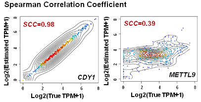
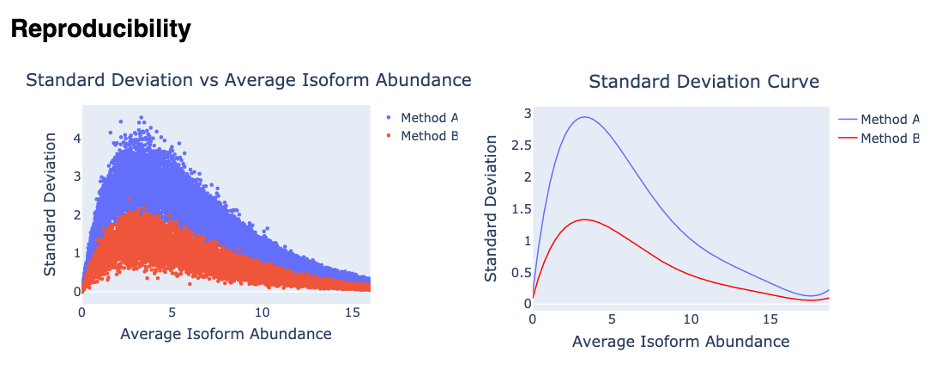
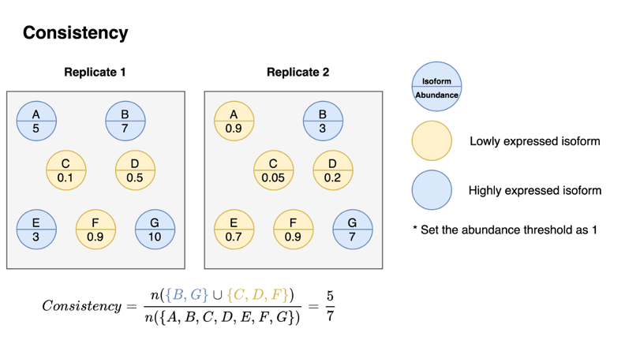
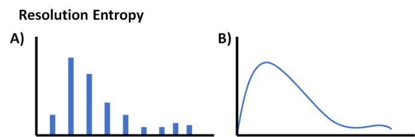
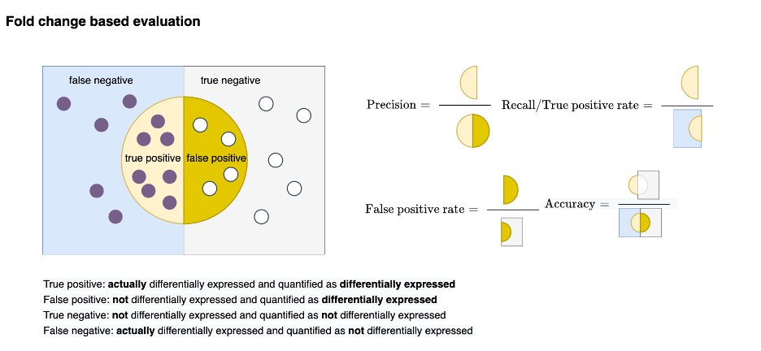
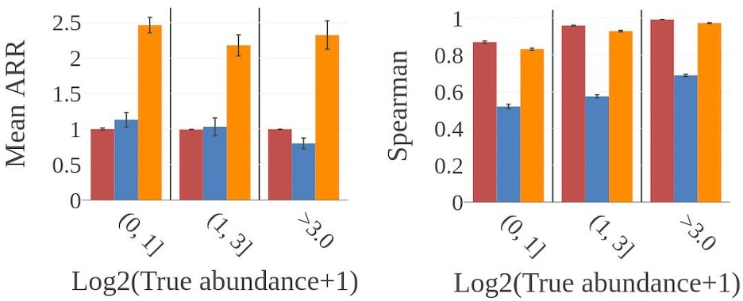

# How the evaluation metrics works
## Spearman' rho
 
Spearman Correlation Coefficient (SCC) between the estimation and gold standard. The SCC reveals gene CDY1 can be accurately quantified but not gene METTL9.
## Reproducibility
 
By fitting the standard deviation versus average isoform abundance into a smooth curve, it can be shown that Method B has a lower standard deviation and higher reproducibility.
## Consistency
 
By setting an expression threshold (e.g., 1 in this toy example), we can define which set of genes express (in blue) or not (in yellow). This statistic is to measure the consistency of the expressed gene sets between replicates. 
## Resolution entropy
 
(A) The software output only a few certain discrete values has lower resolution entropy as it cannot capture the continuous and subtle difference of gene expressions. (B) The software with continuous output values has higher resolution entropy.
## Fold-change-based evaluation
 
By counting the # of transcripts that are differentially expressed, statistics such as precision, recall, and accuracy can be defined and calculated.
## Evaluation with different gene features
 
Explore the relationship between the above evaluation metrics and important features like K-value, expression level, isoform length, and number of exons by splitting the transcripts into groups on these features.
